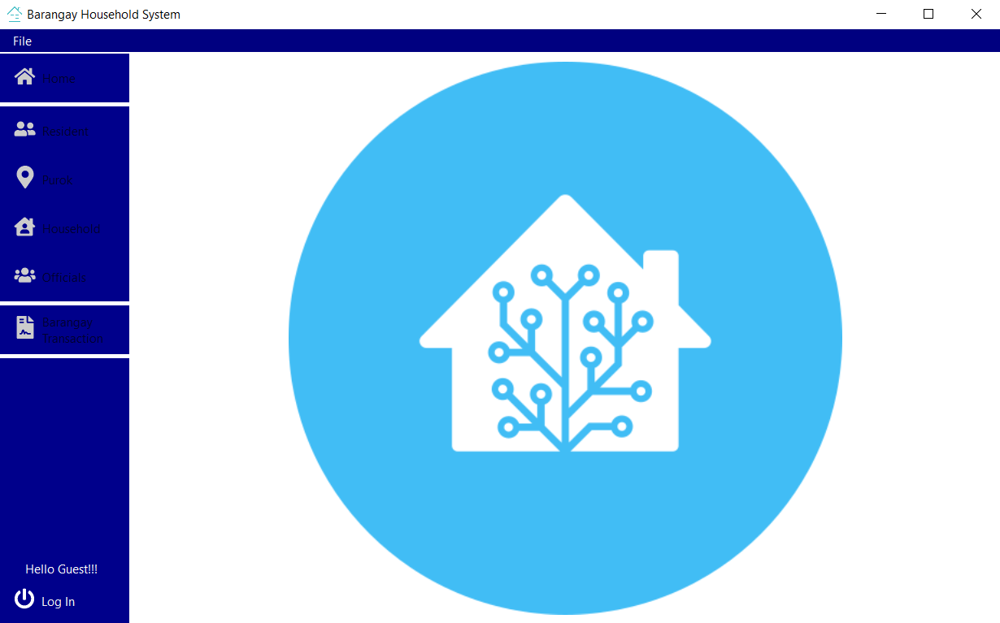
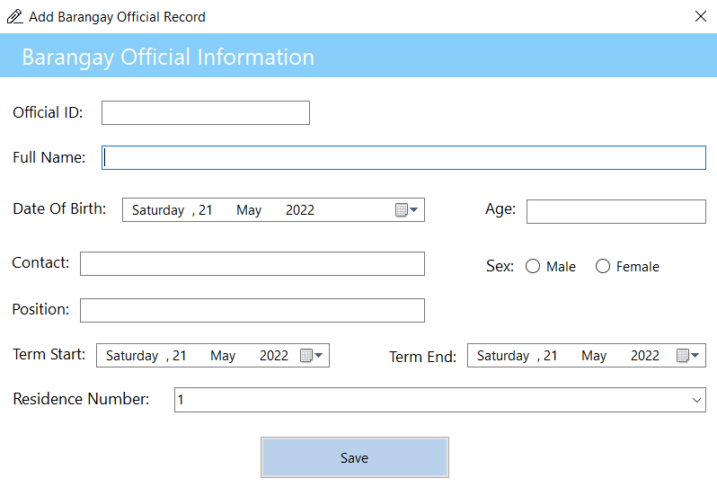
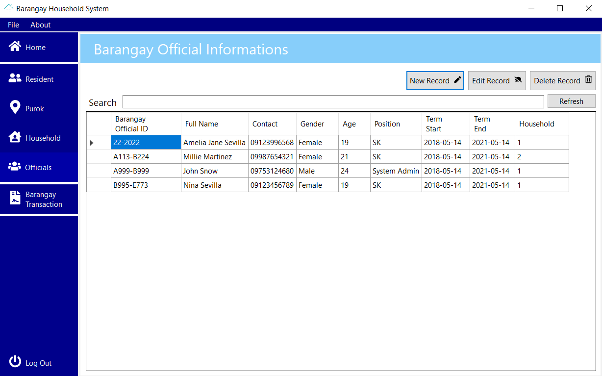
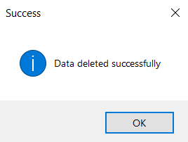

# Barangay Household System

## Description
The Barangay Household System is a database application developed using VB.Net and MySQL. This system is designed to manage and maintain records of households within a barangay, providing functionalities for adding, viewing, updating, and deleting household resident informations.

## Features
- **User Authentication:** Secure login functionality for authorized users.
- **Household Management:** Add, view, update, and delete household records.
- **Reports Generation:** Generate and print reports of household data.
- **Search Functionality:** Efficiently search for specific household records.
- **User Interface:** Easy-to-use graphical user interface with navigation options.

## Screenshots
### Home Screen

### Log In Screen

### Input Screen

### View Screen

### Delete Screen

### Print Screen

## Getting Started

### Prerequisites
- Visual Studio (with VB.Net support)
- XAMPP (for MySQL database)
